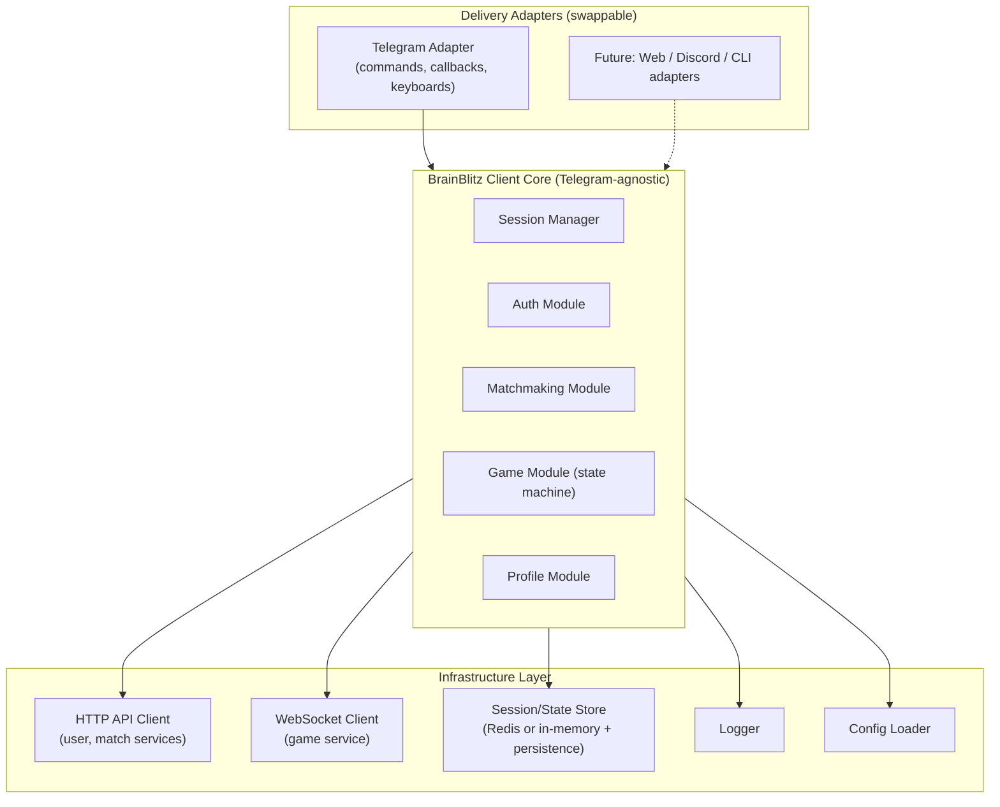
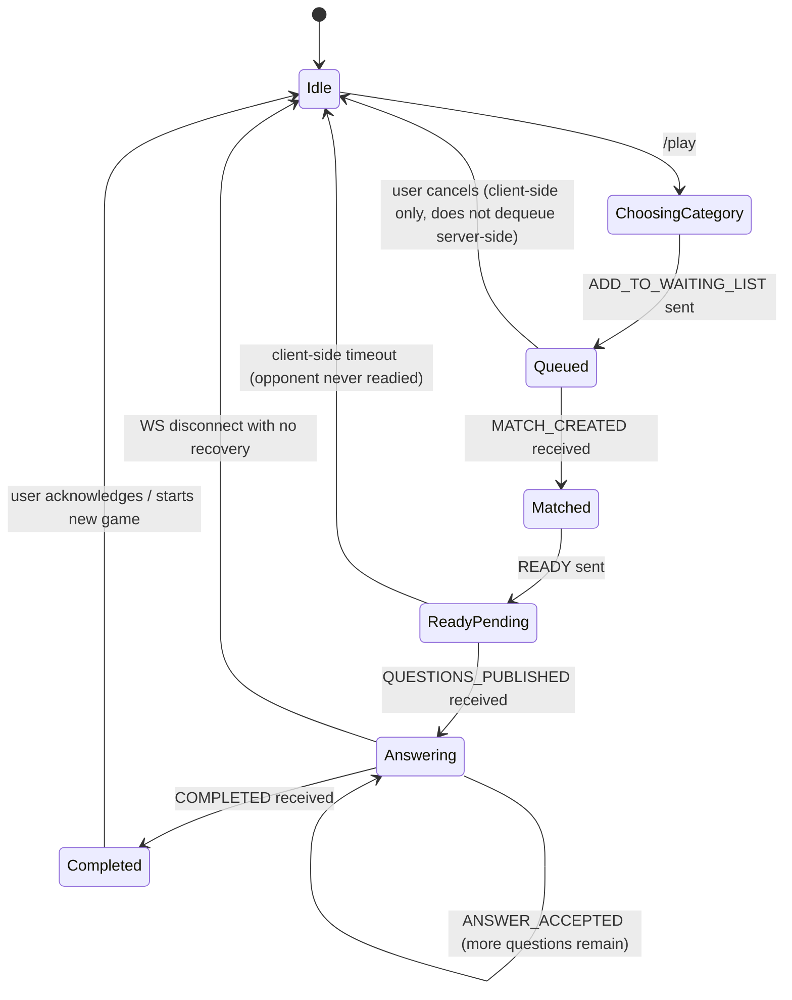

# Client Architecture — Telegram Bot (and future clients)

## Assumptions

**[ASSUMPTION]** The Telegram bot is implemented in Go, matching the backend team's existing stack (`BrainBlitz.com/game` monorepo, Go 1.23) and reusing patterns already established there (layered `delivery → service → repository`, `pkg/` shared utilities, `koanf`-based config, `slog` logging). If the team prefers a different language (Node/Python are common for bots), the layering and responsibilities below still apply — only the folder/package syntax changes.

**[RESOLVED 2026-07-01]** The bot lives at `clients/telegram-bot/` inside this monorepo, as its own Go module (`github.com/nima-abdpoor/brain-blitz-telegram-bot`, own `go.mod`/`go.sum`) rather than a separate repository — chosen for Phase 1 to keep planning docs and implementation co-located and reviewable in one place; it does not share a module with `BrainBlitz.com/game`, so it can still be extracted into its own repository later with no import-path changes beyond the module path itself. Config and logging are independently implemented (not imported from the backend's `pkg/cfg_loader`/`pkg/logger`) precisely because it's a separate module — see `internal/config` and `internal/logger` in the implementation for the resulting small deviations (e.g. the logger returns an instance instead of the backend's global singleton, deliberately, per the "avoid global state" requirement given for this client).

**[ASSUMPTION]** One bot process serves all Telegram users; it is the thing that holds WebSocket connections to game-service on behalf of many Telegram chat IDs simultaneously (a Telegram user never opens their own raw WebSocket — the bot backend is the actual game-service client).

---

## 1. Design Principle: Separate "Brain Blitz Client Core" from "Telegram Adapter"

The single most important architectural decision: **the business logic that talks to the backend (auth, matchmaking, gameplay, WebSocket protocol) must not know anything about Telegram.** Telegram is just one delivery mechanism (analogous to how `delivery/http` and `delivery/grpc` are two deliveries over the same `service` layer in the backend). This is what makes Web/Mobile/Discord/CLI clients cheap to add later — they reuse the same core and add a new delivery adapter.



---

## 2. Folder Structure

```
brain-blitz-telegram-bot/
├── cmd/
│   └── bot/
│       └── main.go                 # entry point: load config, wire dependencies, start
│
├── internal/
│   ├── core/                       # Telegram-agnostic business logic ("the brain")
│   │   ├── auth/
│   │   │   ├── auth.go             # Login, Register, token storage interface
│   │   │   └── auth_test.go
│   │   ├── profile/
│   │   │   └── profile.go          # GetProfile
│   │   ├── matchmaking/
│   │   │   └── matchmaking.go      # JoinQueue (wraps WS ADD_TO_WAITING_LIST)
│   │   ├── game/
│   │   │   ├── state_machine.go    # Client-side game state machine (see §5)
│   │   │   ├── game.go             # Ready, Answer, event handlers
│   │   │   └── state_machine_test.go
│   │   └── session/
│   │       ├── session.go          # Session type: userID, tokens, current game state
│   │       └── store.go            # Store interface (Get/Set/Delete by Telegram chat ID)
│   │
│   ├── apiclient/                  # Infrastructure: talks to BrainBlitz backend
│   │   ├── http/
│   │   │   ├── client.go           # shared HTTP client (base URL, timeouts, retries)
│   │   │   ├── user_client.go      # SignUp, Login, Profile
│   │   │   └── match_client.go     # (optional) AddToWaitingList HTTP fallback — likely unused, see api-analysis
│   │   ├── ws/
│   │   │   ├── client.go           # WebSocket connection lifecycle (connect, reconnect, close)
│   │   │   ├── protocol.go         # Command/Event structs mirroring game-service's JSON envelope
│   │   │   ├── dispatcher.go       # Routes incoming events to registered handlers per session
│   │   │   └── client_test.go
│   │   └── errors.go               # Maps backend error shapes (object AND bare-string, see api-analysis §7) to a single client error type
│   │
│   ├── telegram/                   # Delivery adapter — the ONLY package that imports a Telegram SDK
│   │   ├── bot.go                  # Bot struct, update loop wiring
│   │   ├── commands/
│   │   │   ├── start.go            # /start
│   │   │   ├── play.go             # /play
│   │   │   ├── profile.go          # /profile
│   │   │   └── help.go             # /help
│   │   ├── callbacks/
│   │   │   ├── category.go         # inline keyboard: category selection
│   │   │   ├── ready.go            # inline keyboard: ready button
│   │   │   └── answer.go           # inline keyboard: A/B/C/D answer buttons
│   │   ├── keyboards/
│   │   │   └── keyboards.go        # builds InlineKeyboardMarkup layouts
│   │   ├── middleware/
│   │   │   ├── auth_required.go    # blocks commands needing a session until logged in
│   │   │   └── logging.go
│   │   └── presenter/
│   │       └── presenter.go        # formats core-layer data into Telegram message text/markup (keeps core free of presentation strings)
│   │
│   ├── config/
│   │   └── config.go                # koanf-based config struct: bot token, backend base URLs, timeouts
│   │
│   └── logger/
│       └── logger.go                 # slog wrapper, consistent with backend's pkg/logger conventions
│
├── pkg/                              # only if parts are meant to be reused outside this module
│   └── retry/
│       └── retry.go                  # generic backoff helper
│
├── configs/
│   └── development/
│       └── config.yaml
│
├── deploy/                           # Dockerfile, k8s manifests, mirroring infra/ conventions from main repo
│
├── go.mod
└── README.md
```

**Why this split matters for future clients**: adding a Web client later means writing a new `internal/web/` (or a new repo) that imports `internal/core` and `internal/apiclient` — zero changes to `core` or `apiclient`. The state machine, retry policy, and protocol mapping are written once.

---

## 3. Layers and Responsibilities

| Layer | Responsibility | Knows about Telegram? | Knows about BrainBlitz wire format? |
|---|---|---|---|
| `telegram/` | Parse Telegram updates, render keyboards/messages, call `core/` methods | Yes | No |
| `core/` | Business rules: what a "login," "join game," "answer" *means*; owns the client-side game state machine | No | No (works with clean domain types) |
| `apiclient/` | Translate `core/` calls into HTTP requests / WS frames; translate responses back into domain types; own retry/backoff/reconnect | No | Yes |
| `config/`, `logger/` | Cross-cutting | No | No |

This mirrors the backend's own `delivery → service → repository` inversion (`docs/context/02-architecture.md`): `telegram` ≈ `delivery`, `core` ≈ `service`, `apiclient` ≈ `repository`.

---

## 4. Session Management

A "session" here means: which Telegram chat maps to which BrainBlitz user, their tokens, and their current game state. Since the bot is a single process serving many users, and the backend gives zero session-resume support (see `client-business-flows.md` §8), **the bot itself must be the durable source of truth for in-flight game state.**

```go
// internal/core/session/session.go
type Session struct {
    TelegramChatID int64
    UserID         string
    AccessToken    string
    RefreshToken   string
    TokenIssuedAt  time.Time
    GameState      GameState   // see state machine below
}

type Store interface {
    Get(ctx context.Context, chatID int64) (*Session, error)
    Save(ctx context.Context, s *Session) error
    Delete(ctx context.Context, chatID int64) error
}
```

- **Storage backend**: Redis (the main repo already runs Redis; reusing it — as a *separate* logical DB/prefix, not sharing keys with `game_app`'s Redis — avoids introducing a new infra dependency). In-memory `sync.Map` is acceptable for a first milestone/single-instance deployment, with Redis as the upgrade path once the bot needs to scale beyond one process. Recommend starting in-memory (Phase 1 of the roadmap), migrating to Redis in the resilience phase.
- **Why persistence matters here specifically**: because game-service gives no resync, if the bot process restarts mid-game, the *only* hope of recovering is if the bot itself remembers `gameId`/last question/leaderboard so it can at least tell the user "your game may have ended, here's what we last saw" — the backend cannot help.

**[RESOLVED 2026-07-07 — Phase 6, deviated from the plan above]** `session.Session` was **not** extended with a `GameState` field, and `internal/core/matchmaking`/`internal/core/game`'s in-flight state is **not** persisted to Redis at all — only the auth fields (`UserID`, `AccessToken`, `RefreshToken`, `TokenIssuedAt`) are. Reasoning worked through at implementation time: persisting "chat X was on question 3 of game Y" only has value if the bot can *use* that record after a restart, but there is still no backend API to ask "what actually happened to game Y while I was down" (gap-analysis.md G-14) — the WS connection and the server's own in-memory game state are both gone regardless of what the bot remembers. Displaying a persisted-but-unverifiable "here's what we last saw" message would be indistinguishable from fabricating a recovered state, which this project treats as worse than the alternative: a bot restart cleanly ends any in-flight game (the user sees nothing, and simply needs to `/play` again), while a restart no longer forces a full `/login`. `session.RedisStore` (`internal/core/session/redis_store.go`) implements exactly the `Store` interface already defined above, keyed `telegram-bot:session:<chatID>`, selected via `session_store.type: "redis"` in config (default remains `"memory"`, i.e. Phases 1-5's behavior).

---

## 5. Client-Side Game State Machine

Since the backend has no server-side state machine gating command order (see api-analysis §4, point 9), the bot **must** enforce valid transitions locally to avoid confusing/undefined backend behavior (e.g. sending `ANSWER` before `READY`).



Each state determines which Telegram commands/callbacks are valid — e.g. the `answer` callback handler should no-op (or show "not your turn") if the session isn't in `Answering`. This state machine lives in `internal/core/game/state_machine.go` and is unit-testable without any Telegram or network dependency.

---

## 6. Authentication Handling

- Bot stores `accessToken` + `refreshToken` per session after login (see `client-business-flows.md` §2–3).
- Every outbound HTTP/WS call attaches `Authorization: Bearer <accessToken>`.
- On `401`/token-invalid response: since there is **no working refresh endpoint** (confirmed gap), the bot's only correct behavior today is to clear the session's tokens and prompt `/login` again. Do not build speculative refresh logic against a nonexistent endpoint — wire it once `backend-improvements.md` item #1 ships, behind a feature check.
- Telegram identity (`chatID`/Telegram user ID) is **not** the same as BrainBlitz `userID` — the bot must maintain that mapping itself (one Telegram account could in principle map to re-registering under a different email, though a first version can assume 1:1).

---

## 7. API Client Layer

- **HTTP client** (`apiclient/http`): thin wrapper per backend service (`user_client.go` for signup/login/profile). Owns:
  - Base URLs per environment (configurable, pointing at the Traefik gateway, e.g. `https://api.brainblitz.example/user-service`)
  - Request timeout (e.g. 10s)
  - Retry policy for idempotent/safe calls (see §9)
  - Error normalization (api-analysis §7 documents inconsistent shapes — bare strings vs `{message,error}` objects; `apiclient/errors.go` is the one place that absorbs this inconsistency so `core/` never sees raw JSON quirks)

- **WebSocket client** (`apiclient/ws`): owns exactly one connection per active session.
  - `Connect(ctx, session)` — dials `game-service`'s `/api/v1/process-game`, attaches `Authorization` header.
  - `Send(command)` / event dispatch to registered per-session handlers (`dispatcher.go`).
  - Since the backend gives no ping/pong or keepalive contract documented, the client should implement its own periodic ping (if the underlying WS library supports it) to detect dead connections proactively rather than waiting for a write to fail.
  - Reconnect: on unexpected close, the client library may attempt one automatic reconnect attempt (new TCP connection, same `X-User-ID`/token) per `client-business-flows.md` §8, but must not assume any state resync — it should immediately surface "reconnected, but game context may be stale" to `core/`, which decides what to tell the user based on the state machine.

---

## 8. Error Handling Strategy

Three error classes, handled at different layers:

| Class | Example | Handled in | User-facing behavior |
|---|---|---|---|
| Network/transport | Connection refused, timeout | `apiclient` | Retry per policy (§9), then bubble a generic "BackendUnavailable" domain error |
| Backend business error | "invalid category", "user not found" | `apiclient` normalizes → `core` interprets | `telegram/presenter` renders a specific, friendly message |
| Client-side logic error | Command sent in wrong state | `core` state machine | Telegram layer should never let this happen via UI (disable stale buttons), but core should still guard defensively |

All errors funnel through a single `ClientError` type (`apiclient/errors.go`) carrying: `Kind` (network/backend/validation), `Message`, `Retryable bool`. This gives `core/` and `telegram/` one consistent thing to switch on instead of parsing raw HTTP status codes or WS message strings everywhere.

---

## 9. Retry Strategy

| Operation | Policy |
|---|---|
| `POST /signup`, `/login` | 3 attempts, exponential backoff starting at 1s, only on network error or 5xx (never on 4xx) |
| `GET /profile` | 3 attempts, same backoff (safe — read-only) |
| WS connect | 5 attempts, exponential backoff capped at 30s, then surface a persistent "can't connect" state to the user with a manual retry button |
| WS command send (`READY`, `ANSWER`, `ADD_TO_WAITING_LIST`) | No automatic retry — these are not guaranteed idempotent server-side (e.g. resending `ADD_TO_WAITING_LIST` after a suspected failure could double-enqueue since there's no idempotency key in the protocol). Instead, surface the failure and let the user explicitly retry via the UI. |

This matches the constraints already discovered in `client-business-flows.md` §10 — repeating here as the concrete implementation policy.

**[RESOLVED 2026-07-07 — Phase 6]** Implemented as `pkg/retry.Do(ctx, retry.Policy{MaxAttempts, BaseDelay, MaxDelay}, func() error)`, a single generic backoff helper. `internal/apiclient/http.Client` (signup/login/profile) delegates to it — same attempt counts and timing as before, just no longer duplicated ad hoc. The WS-connect dialer (wired in `cmd/bot/main.go`, used by `internal/core/matchmaking.Manager.JoinQueue`) uses it with `MaxAttempts: 5, BaseDelay: 1s, MaxDelay: 30s`. WS command sends (`READY`, `ANSWER`, `ADD_TO_WAITING_LIST`) still get no automatic retry, exactly as specified above — `pkg/retry` was deliberately not applied there. Also added: `pkg/ratelimit` (wrapping `golang.org/x/time/rate`), consulted by both `http.Client` (opt-in via `WithRateLimiter`) and the WS dialer, gated by new `rate_limit` config — off by default, so this doesn't change behavior for a deployment that doesn't configure it.

---

## 10. Logging

- Structured logging (`slog`), same convention as the backend (`pkg/logger`): JSON output, key-value pairs, one log line per significant event (command received, API call made, WS event received, state transition).
- **Never log tokens or full Authorization headers** — the backend has a documented history of a secret-leak bug (`docs/context/07-known-issues.md` #2); the bot should not repeat that mistake for user tokens.
- Correlate logs by `chatID` and `userID` so a support engineer can trace one user's session across a game.

---

## 11. Configuration

`koanf`-based (matching backend convention), loaded from YAML + env var overrides:

```yaml
telegram:
  bot_token: "${TELEGRAM_BOT_TOKEN}"
backend:
  user_service_url: "http://localhost/user-service"
  match_service_url: "http://localhost/match-service"
  game_service_ws_url: "ws://localhost/game-service/api/v1/process-game"
  http_timeout: 10s
session_store:
  type: "memory"   # "memory" | "redis"
  redis_addr: "localhost:6380"
logging:
  level: "info"
```

---

## 12. Extensibility for Future Clients

Because `core/` and `apiclient/` contain zero Telegram-specific code:

- **Web client**: new `internal/web/` (REST/WebSocket-to-browser gateway) that calls the same `core/` methods; the browser talks to the bot's own backend, which proxies to BrainBlitz — or the web client could bypass the bot entirely and be a true independent client reusing only the *pattern*, not the running process. Both are valid; document the choice when it's actually built.
- **Discord bot**: same shape as Telegram — a new delivery adapter, same `core/`.
- **CLI**: trivial — a delivery adapter that reads stdin commands and prints events.

The only thing that would ever need to change for a new client is `core/`'s public interface if a genuinely new capability is needed (e.g. exposing queue-cancel once the backend supports it) — never the protocol/session/retry internals, which live in `apiclient/`.
