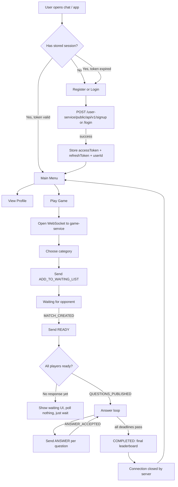
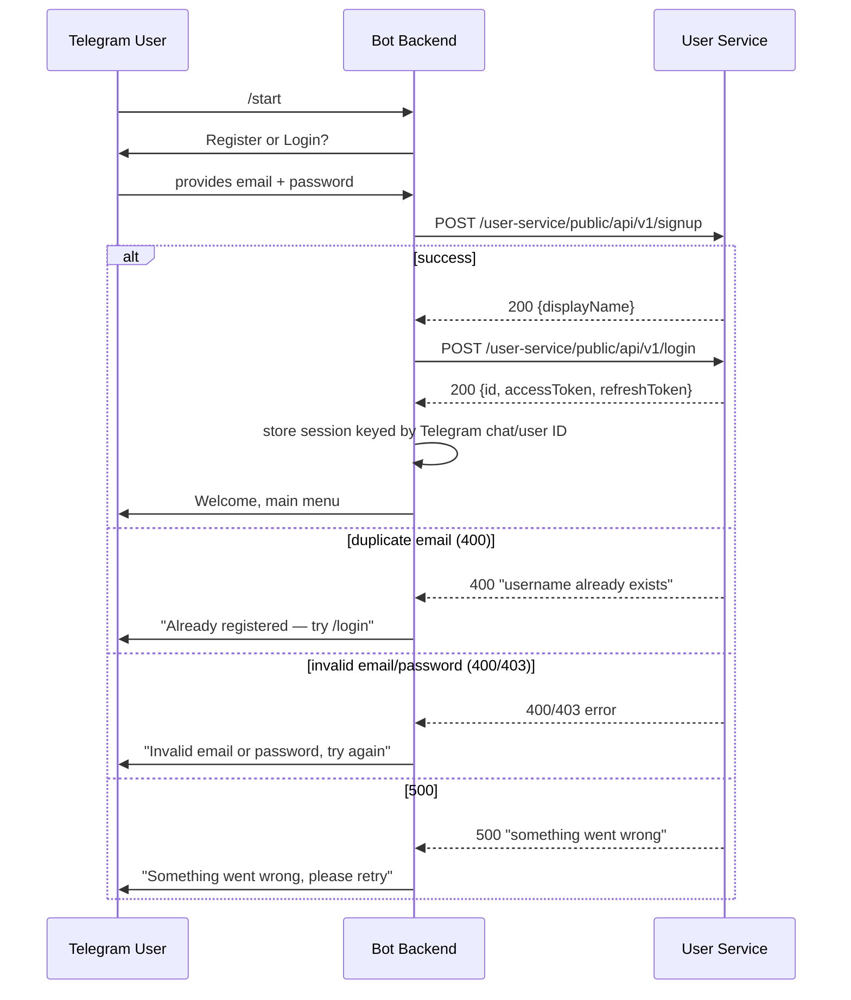
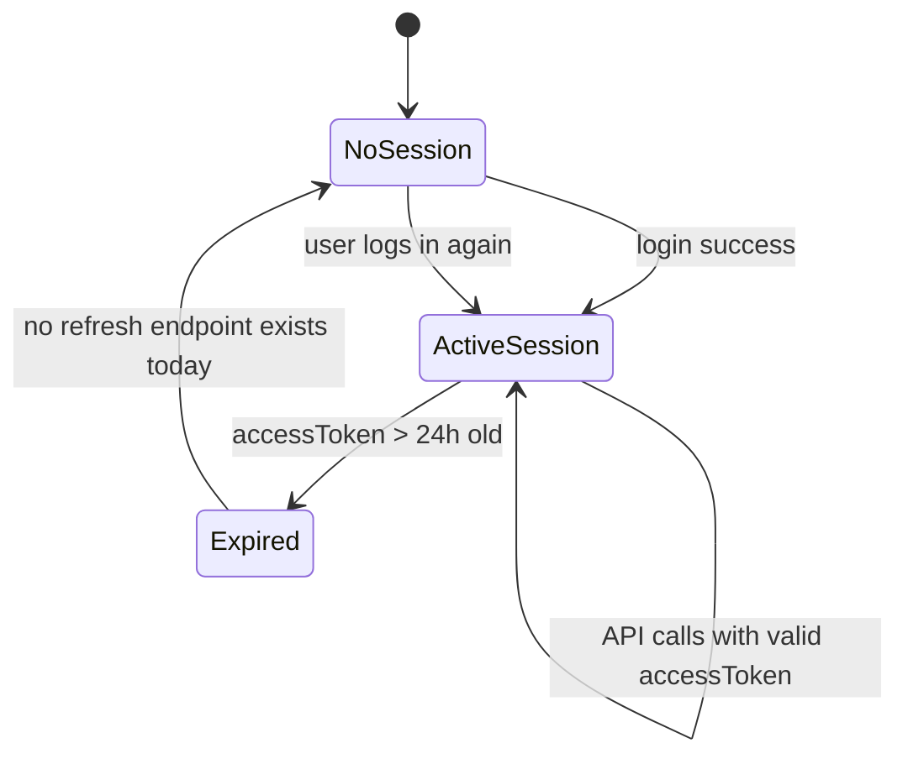
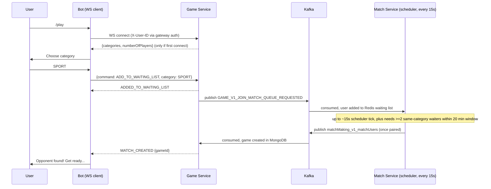
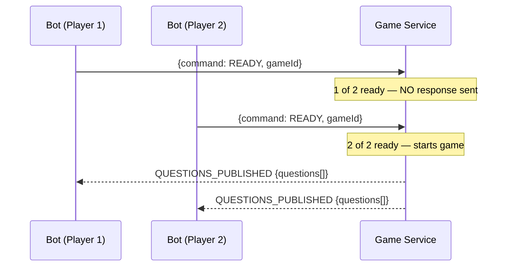
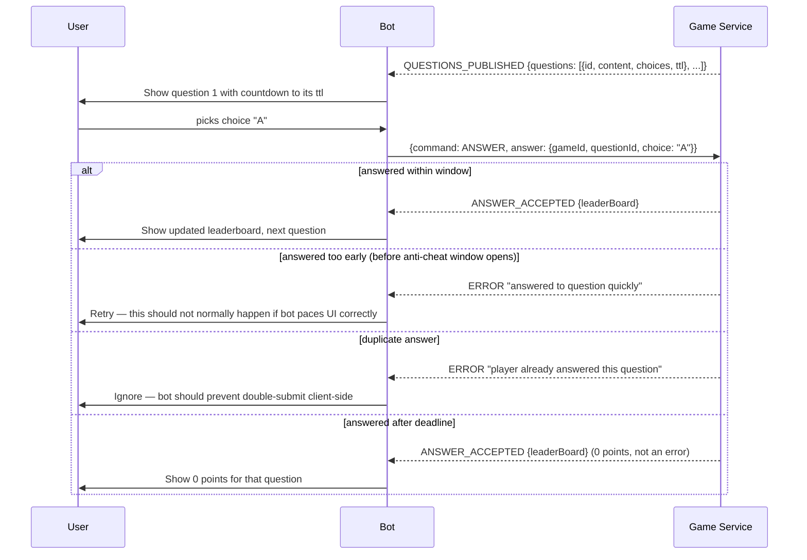
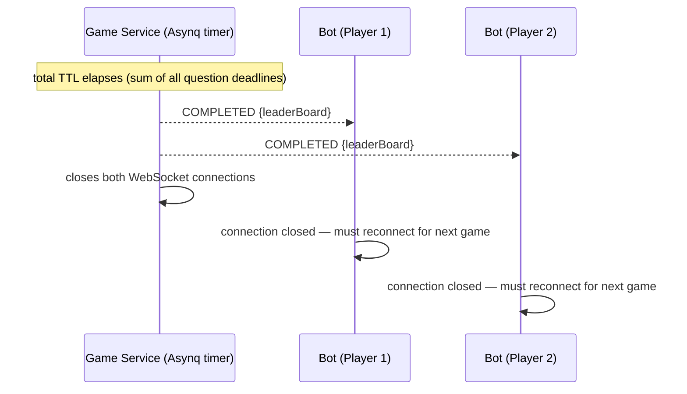
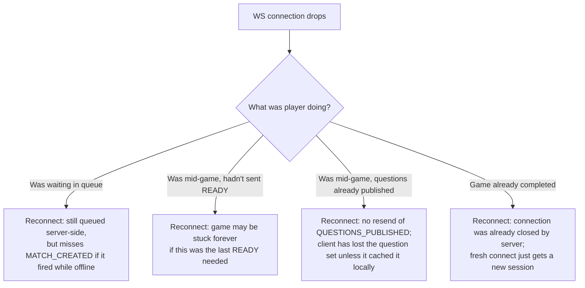

# Client Business Flows

This maps the full player journey as a client (Telegram bot or otherwise) would experience it, based on the verified API surface in `backend-api-analysis.md`. It supersedes `docs/business/02-business-flows.md` for client-facing purposes by adding failure/retry/timeout detail that document didn't need to cover.

## 1. End-to-End User Journey

## 2. Registration / Login

**Failure/retry notes**:
- No idempotency concern: signup either creates the user or fails with a duplicate error the bot can catch and redirect to login.
- Login "user not found" incorrectly returns `500`, indistinguishable from a real server error. The bot **cannot reliably tell "wrong email" apart from "server is down"** from this response alone — it should present a generic "check your credentials or try again shortly" message rather than a confident "user not found."
- No retry-after / backoff signal from the backend on `500` — bot should apply its own exponential backoff (e.g. 3 attempts, 1s/2s/4s) for transient failures, but not for `400`/`403` (those are certain user errors).

## 3. Token Lifecycle

**Critical gap**: because there is no token-refresh HTTP endpoint (see `backend-api-analysis.md` §7), the bot cannot silently renew a session. Once the 24h access token expires, the stored `refreshToken` is currently useless from the client's perspective — the bot must force the user through `/login` again. This must be designed around explicitly (see `gap-analysis.md` — categorized as "Needs small backend changes").

## 4. Matchmaking — Join, Wait, Match Found

**Timeout/retry behavior**:
- **No timeout exists server-side** for a lone waiter — if no second player joins the same category within the 20-minute window, the user simply waits forever with no expiry notification. The bot must implement its own client-side "give up after N minutes" UX (e.g. offer a Cancel button) since there is no "leave queue" backend command either (see gap analysis) — cancelling is a UI-only illusion unless the backend adds a leave-queue endpoint.
- Typical match latency: 0–15s scheduler tick + Kafka propagation (sub-second in practice) — the bot should show a "matching..." indicator rather than expect near-instant response.
- If the WS connection drops while waiting, the user's Redis waiting-list entry is untouched (still queued) but they will not receive the eventual `MATCH_CREATED` push unless they reconnect with the same `X-User-ID` before the match is dispatched.

## 5. Game Start — Ready Synchronization

**Failure scenario**: if Player 1 sends `READY` but Player 2 never does (disconnected, closed the app, ignored the prompt), Player 1 receives **no error, no timeout notification, nothing** — they wait indefinitely. There is no server-side abandonment detection. A production-quality bot should apply a client-side wait timeout (e.g. 60–90s) and, on expiry, tell the user the opponent didn't respond — but cannot actually cancel or requeue the match server-side today (no such endpoint exists).

## 6. Answering Questions

**Design implication for the bot**: because all questions are delivered up front (`QUESTIONS_PUBLISHED` sends the whole array with individual per-question `ttl` deadlines, not one at a time), the bot is responsible for pacing the UI — showing question N only when its answer window is open, and locally enforcing "don't let the user submit before this question's window starts" to avoid the confusing `"answered to question quickly"` error. This is entirely a client-side state machine concern; the backend gives no "next question please" signal.

## 7. Game Completion

**Failure scenario**: if the leaderboard fetch fails server-side, players get `COMPLETED` with `success:false` and an empty leaderboard instead — the bot should treat this as "game ended, results unavailable" rather than crash on missing fields.

## 8. Reconnection (Current State — No Real Support)

**Implication**: the bot backend (not just the Telegram client) MUST persist per-user in-flight game state (last known `gameId`, `matchId`, received questions, current leaderboard) in its own storage, because the backend provides no replay/resync mechanism. This is a core architectural requirement, not an optional resilience nicety — see `client-architecture.md` §Session Management and `gap-analysis.md`.

## 9. Error Handling Summary Table

| Failure class | Backend behavior | Bot must... |
|---|---|---|
| HTTP 5xx from user/match service | Generic message, no retry hint | Apply its own backoff/retry (idempotent GETs safe to retry; POSTs like signup/login safe to retry since they're naturally idempotent-ish by error type) |
| WS command silently ignored (READY, GET_CATEGORIES) | No response frame at all | Apply client-side timeouts, never block waiting for an ack that may never come |
| WS command produces contradictory frames (bad category) | ERROR then success | Process events in order; don't assume one cancels the other |
| WS connection drop | No cleanup, no resync | Persist state locally; treat reconnect as "new socket, old context" |
| Kafka/scheduler pipeline delay | Up to ~15s + processing | Show a "matching..." spinner, not a spinner that times out prematurely |

## 10. Retry & Timeout Policy Recommendations for the Bot (client-side only — no backend changes assumed)

| Scenario | Recommended client policy |
|---|---|
| HTTP call to user-service fails with network error / 5xx | Retry 3x with exponential backoff (1s, 2s, 4s), then show error |
| HTTP call fails with 4xx | Do not retry; surface the specific message to the user |
| WS connect fails | Retry with backoff, cap at e.g. 5 attempts, then tell user to try `/play` again later |
| Waiting for `MATCH_CREATED` | No hard timeout enforced by backend; offer the user a manual "Cancel" that just stops showing the waiting UI (cannot actually dequeue) |
| Waiting for `QUESTIONS_PUBLISHED` after sending `READY` | Client-side timeout ~60-90s; if exceeded, inform user opponent may have disconnected |
| Waiting for `ANSWER_ACCEPTED` | Short timeout (~5-10s more than the answer window); if no response, assume network issue and let user know |
| WS unexpectedly closes mid-game | Attempt one reconnect; if game state can't be recovered (no resync from server), inform the user the game may have ended and direct them to start a new one |
