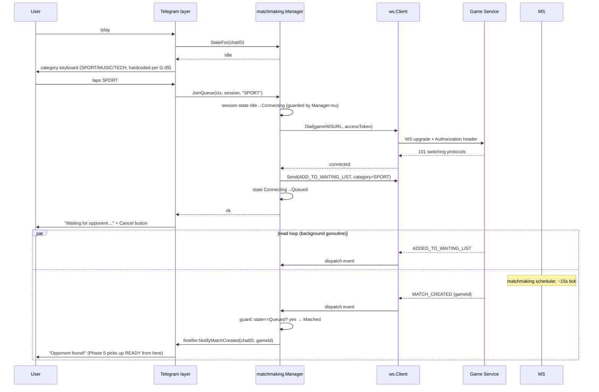
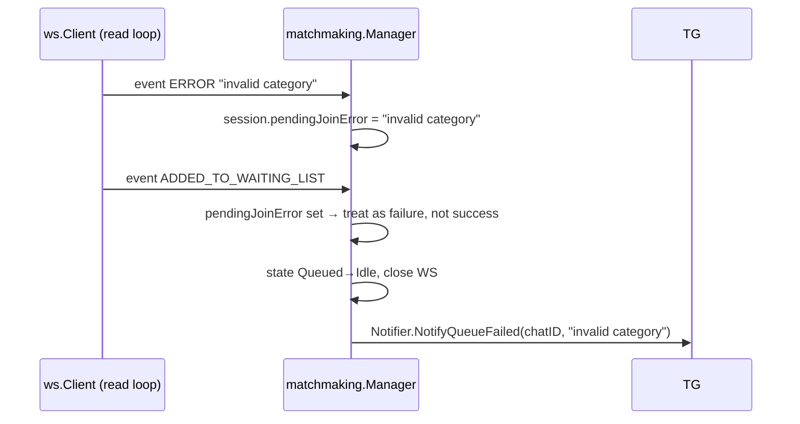
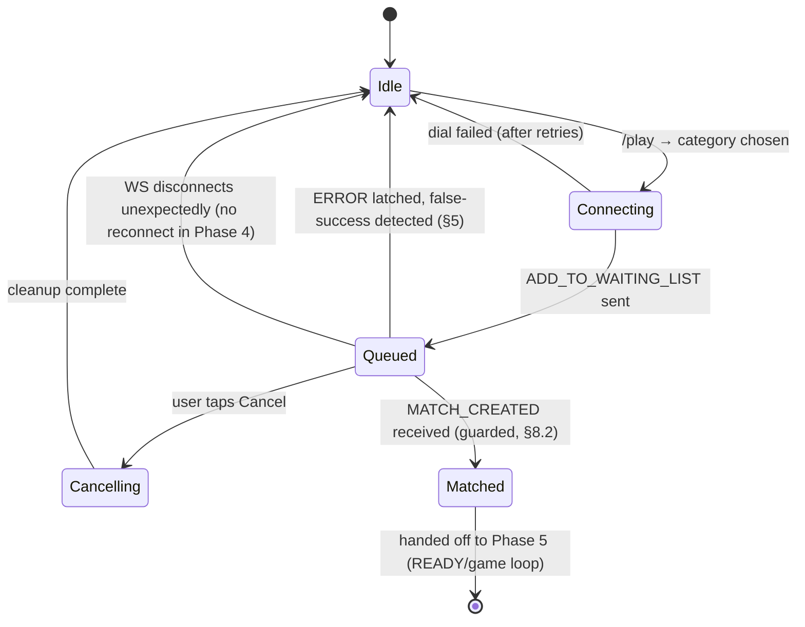

# Phase 4 — Matchmaking: Implementation Plan

Status: **[RESOLVED 2026-07-07] Implemented as designed** — all three open questions below were approved as recommended (`gorilla/websocket`, hardcoded categories, honest Cancel copy) and the code matches this plan; see `client-roadmap.md` Phase 4's implementation notes for what actually shipped and what tests cover. Scope matches
`client-roadmap.md` Phase 4: WebSocket client, `ADD_TO_WAITING_LIST` wrapper, category
selection UI, waiting-state UI with best-effort Cancel, `MATCH_CREATED` handling.
Stops at the moment a match is created — READY/questions/answers are Phase 5.

Grounded in `backend-api-analysis.md` §4 (WS protocol + quirks), `client-business-flows.md`
§4–5, `gap-analysis.md` G-08/G-09/G-10/G-13, and `client-architecture.md` §5–9 (state
machine / auth / retry policy already sketched there — this doc makes it concrete and
implementable, and resolves the open questions).

---

## 1. Package plan

Matches `client-architecture.md` §2, no deviations:

| File | Responsibility |
|---|---|
| `internal/apiclient/ws/protocol.go` | Command/Event wire structs, event name constants |
| `internal/apiclient/ws/client.go` | One WS connection: dial+auth, serialized writes, read loop |
| `internal/core/matchmaking/matchmaking.go` | `Manager`: per-chat state machine, owns `ws.Client` instances, drives the join-queue flow |
| `internal/telegram/notifier.go` | Implements a `core`-defined `Notifier` interface; the one place async server pushes turn into Telegram messages |
| `internal/telegram/commands/play.go` | `/play` command |
| `internal/telegram/callbacks/category.go` | Category button + Cancel button |
| `internal/config/config.go` | Already has `Backend.GameServiceWSURL` — no change needed |

**Decision needed from you:** WS client library. Recommending **`gorilla/websocket`**
over `coder/websocket` (nhooyr) — it's the de facto standard, its single-reader/
single-writer concurrency rule is exactly the model this design needs and is
well-documented, and it matches this codebase's pattern so far of picking boring,
widely-used libraries (`tgbotapi`, `koanf`) over newer alternatives. Flagging as a
decision point the same way Phase 1 flagged the Telegram library choice.

---

## 2. WebSocket lifecycle

One `ws.Client` per Telegram chat with an active queue/game, held in
`matchmaking.Manager.sessions map[int64]*Session` (mirrors the existing
`session.MemoryStore` / `conversation.MemoryStore` map+mutex pattern already in the
codebase).

```
Dial(ctx, url, accessToken)
  → http.Header{"Authorization": "Bearer " + accessToken} passed to the upgrade request
  → gateway's ForwardAuth validates the token before the upgrade completes
  → on 401/upgrade failure: no retry (bad token isn't a transient failure) —
    surface immediately as "session expired, please /login"
  → on network error: retry per §7 (Retry strategy)
```

`ws.Client` internals:
- `writeMu sync.Mutex` — gorilla/websocket forbids concurrent writes on one connection; every `Send` acquires it. Not exercised by more than one command in Phase 4 (only `ADD_TO_WAITING_LIST`), but built now since Phase 5 adds `READY`/`ANSWER` on the same connection.
- `Listen(handler func(Event))` — runs the read loop on the calling goroutine (the `Manager` starts it via `go`); returns when the connection closes, with the closing error. This is the single point of ordering guarantee: one TCP stream, one reader, events dispatched strictly in arrival order.
- `Close()` — closes the underlying conn; `Listen`'s blocking `ReadMessage` returns promptly. Must be safe to call twice (cancel-then-natural-close race, see §6).

## 3. Authentication over WS

- Reuses `session.Session.AccessToken` from Phase 2 — no new token storage.
- Gateway-level auth only (per `backend-api-analysis.md` §4: game-service itself just trusts `X-User-ID` injected by Traefik after ForwardAuth succeeds) — the bot has nothing to add beyond sending the header correctly.
- No refresh-token flow exists (G-12) — if `AccessToken` is stale, `Dial` fails at the upgrade and the bot tells the user to `/login` again, per `client-architecture.md` §6. No speculative refresh logic.
- `JoinQueue` should check `session.Session` freshness (`TokenIssuedAt` vs. 24h) *before* dialing, to fail fast with a clear message rather than opaquely through a WS upgrade error.

## 4. Match creation & waiting-state flow



## 5. Handling the invalid-category quirk (ERROR then false success)

Per `backend-api-analysis.md` §4 point 1, an invalid category produces **both** an
`ERROR` and a subsequent `ADDED_TO_WAITING_LIST`. The `Session` latches this:



This directly implements the doc's rule "process events in order, don't assume one
cancels the other" instead of trusting whichever event happens to be read last.

## 6. Cancellation semantics (must be stated explicitly — this is a UX trap)

Per G-13, there is no server-side "leave queue." `Cancel(chatID)`:

1. Set `session.state = Cancelling` **first** — this is the guard that makes the
   race in §8.2 safe (any `MATCH_CREATED` arriving after this point is ignored).
2. Close the WS connection (best-effort).
3. Remove from `Manager.sessions`; final local state `Idle`.
4. Telegram layer shows an honest message, not a bare "Cancelled": the user's Redis
   waiting-list entry is untouched server-side until the 20-minute window lapses, so
   if the scheduler had already started pairing them the instant before Cancel,
   the opponent may still end up waiting on a `READY` that will now never come
   (G-15 — no abandonment detection either). The bot cannot fix this; it can only
   be honest about it. Recommended copy: *"You've stopped waiting. Note: if a match
   was already forming, the other player may briefly wait on you — this is a known
   backend limitation."*

This is a real product cost of G-13, not just a UI nicety, and should be called out
to the user rather than papered over with a confident "Cancelled ✓".

## 7. Retry strategy

| Operation | Policy | Why |
|---|---|---|
| WS `Dial` | 5 attempts, exponential backoff 1s→2s→4s→8s→16s, capped at 30s total, then surface a manual "try /play again" | Matches `client-architecture.md` §9; network hiccups are transient, upgrade auth failures are not (see below) |
| WS upgrade fails with 401/auth error | No retry | Retrying with the same bad token can't succeed; fail fast to "/login" |
| `ADD_TO_WAITING_LIST` send | No automatic retry | Not idempotent-safe by design (no dedup key server-side) — a retried send after a suspected failure risks a confusing double-queue-entry. Surface the failure, let the user explicitly retry via `/play` |
| Waiting for `MATCH_CREATED` | No backend timeout exists; bot applies **no** hard timeout either in Phase 4 (that's explicitly a Phase 6 resilience concern) — Cancel is the only user-facing "stop" | Avoid scope creep into Phase 6 |

## 8. Potential race conditions

1. **Double `/play` / double category tap.** Two near-simultaneous taps before the
   first `Dial` completes could create two `ws.Client`s for one chat, leaking the
   first connection's read-loop goroutine and socket. *Mitigation:* `JoinQueue`
   takes `Manager.mu`, checks existing session state; if it's already
   `Connecting`/`Queued`/`Matched`, return `ErrAlreadyInProgress` immediately rather
   than starting a second dial.

2. **Cancel racing `MATCH_CREATED`.** User cancels the instant the scheduler pairs
   them. *Mitigation:* the `Cancelling` state guard in §6 step 1 — the event
   handler checks `state == Queued` before acting on `MATCH_CREATED`; anything else
   is logged and dropped, and the (now unwanted) connection is closed as cleanup.

3. **Read-loop goroutine outliving `Close()`.** If `Close()` doesn't reliably
   unblock the in-flight `ReadMessage`, every disconnect/cancel leaks a goroutine.
   *Mitigation:* verify (with a test) that closing the underlying `net.Conn`
   unblocks a concurrent read — this is a gorilla/websocket-documented behavior but
   must be asserted, not assumed.

4. **Concurrent writes on one connection.** Phase 4 only ever sends one command
   type, but the `writeMu` in `ws.Client.Send` is built now so Phase 5 (which adds
   `READY`/`ANSWER` from callback handlers while the read loop is also live) can't
   introduce a torn write later.

5. **Notifier callbacks racing the Telegram update loop.** `Notifier.NotifyMatchCreated`
   fires from the WS read-loop goroutine — a different goroutine than the one
   `Bot.handleCallback` uses when the user presses Cancel at roughly the same
   moment. Both may end up calling `tgAPI.Send` for the same chat concurrently.
   `tgbotapi.BotAPI.Send` wraps a plain `http.Client` call and is safe for
   concurrent use, but message *ordering* to the user isn't guaranteed across two
   independent goroutines — acceptable here because the `Cancelling` state guard
   (item 2) already prevents the *logical* conflict (a "matched" message after a
   "cancelled" message can't happen once the guard is in place), even if the two
   Telegram messages could theoretically arrive slightly out of send-order.

6. **Bot process restart while a user is queued.** All state is in-memory
   (`Manager.sessions`, and the underlying TCP connection). A restart silently
   drops the connection server-side too — the user's Redis queue entry lingers but
   nothing will ever deliver `MATCH_CREATED` to them. Explicitly out of scope for
   Phase 4 (no persisted matchmaking state yet); flagged for Phase 6 per
   `client-architecture.md` §4. Phase 4 should not attempt a partial fix here.

## 9. State transitions (Phase 4 slice)



This is the same shape as `client-architecture.md` §5's full state machine,
scoped down to what Phase 4 actually implements — `Matched` is a hand-off point,
not a dead end; the `ws.Client` connection stays open and Phase 5 continues using
it rather than reconnecting.

## 10. Testing plan

- `ws.Client`: unit tests against a local `httptest` WS server — dial+auth header
  assertion, write serialization under concurrent `Send` calls, `Close()` unblocking
  a pending read (item 3 above).
- `matchmaking.Manager`: unit tests with a fake `Dialer`/`ws.Client` (interface,
  no real sockets) covering: double-join guard, ERROR-then-success latch, cancel-vs-
  match-created race (deterministic via a channel-controlled fake event feed, not
  a sleep-based timing test), disconnect cleanup.
- Manual test against local `docker-compose up` backend for the real end-to-end
  happy path and the two documented WS quirks, per `client-roadmap.md`'s own risk
  note for this phase.

---

## Open questions before implementation starts

1. Confirm `gorilla/websocket` as the WS library (§1), or prefer `coder/websocket`.
2. Confirm the Cancel-button copy in §6 is acceptable, or want different wording.
3. Confirm hardcoding categories client-side (`SPORT`/`MUSIC`/`TECH`) rather than
   waiting on the first-connect push is fine for Phase 4 (matches G-09's documented
   workaround).
